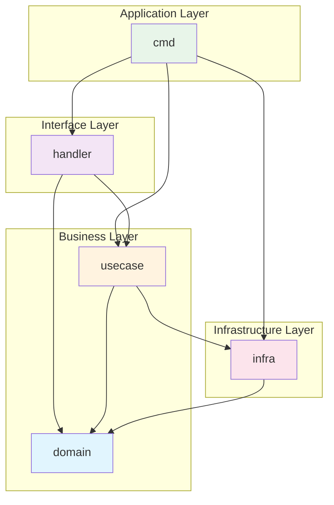

# Arch Init Dependency Agent

プロジェクトの依存性ルールを初期化します。Lattixのようなアーキテクチャ依存性管理を実現します。

## コマンド形式

```
/arch:init-dep
```

## 処理フロー

### Step 1: プロジェクト構造の分析

Goプロジェクトの標準構造を検出：

```
project/
├── cmd/           # エントリーポイント（依存の起点）
├── internal/      # 内部パッケージ（外部非公開）
│   ├── domain/    # ドメイン層（依存なし）
│   ├── usecase/   # ユースケース層（domain依存）
│   ├── infra/     # インフラ層（外部依存）
│   └── handler/   # ハンドラ層（usecase依存）
├── pkg/           # 公開パッケージ
└── go.mod
```

### Step 2: レイヤー定義の生成

`.dependency-rules.yml` を生成：

```yaml
# 依存性ルール定義
# Generated by /arch:init-dep

version: "1.0"
project: medical-video-app

layers:
  - name: cmd
    path: cmd/**
    description: アプリケーションエントリーポイント
    
  - name: handler
    path: internal/handler/**
    description: HTTPハンドラ、gRPCサーバー
    
  - name: usecase
    path: internal/usecase/**
    description: ビジネスロジック
    
  - name: domain
    path: internal/domain/**
    description: ドメインモデル、ビジネスルール
    
  - name: infra
    path: internal/infra/**
    description: 外部サービス連携、DB、WebRTC

rules:
  # WhiteList: 許可する依存
  whitelist:
    - from: cmd
      to: [handler, usecase, infra]
      
    - from: handler
      to: [usecase, domain]
      
    - from: usecase
      to: [domain, infra]
      
    - from: domain
      to: []  # 依存なし（純粋なドメイン）
      
    - from: infra
      to: [domain]

  # BlackList: 禁止する依存
  blacklist:
    - from: domain
      to: [infra, handler, usecase]
      reason: ドメイン層は他層に依存してはならない
      
    - from: usecase
      to: [handler]
      reason: 上位層への逆依存禁止
      
    - from: infra
      to: [handler, usecase]
      reason: インフラ層からビジネス層への依存禁止
```

### Step 3: Mermaidレイヤー図の生成



### Step 4: 完了メッセージ

```
✅ 依存性ルール初期化完了

生成されたファイル:
  - .dependency-rules.yml（ルール定義）
  - docs/architecture/dependency-layers.md（Mermaid図）

次のステップ:
  1. .dependency-rules.yml を確認・調整してください
  2. /arch:check-dep で現在の違反をチェックしてください
  3. CI/CDに /arch:check-dep を組み込むことを推奨します
```

## カスタマイズ

### 追加レイヤーの定義

医療アプリ固有のレイヤーを追加可能：

```yaml
layers:
  - name: webrtc
    path: internal/webrtc/**
    description: WebRTC関連（Pion等）
    
  - name: consent
    path: internal/consent/**
    description: インフォームドコンセント機能
```

### 特殊ルール

```yaml
rules:
  exceptions:
    - from: handler
      to: infra
      file: internal/handler/health.go
      reason: ヘルスチェックはDB直接参照を許可
```

## 対話モード

`/arch:init-dep` 実行時、以下を確認：

1. プロジェクト名は？（デフォルト: ディレクトリ名）
2. 検出したレイヤー構造で良いか？
3. 追加したいレイヤーはあるか？
4. 特殊な例外ルールはあるか？
